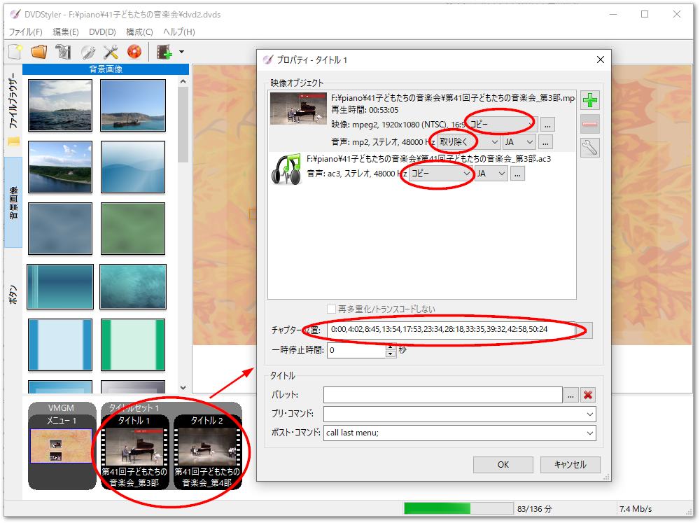

# DVDオーサリング

[DVDStyler](https://dvdstyler.com/)を用いたDVDオーサリング手順について示します。

高画質・高音質でオーサリングする
    : あらかじめ kdenliveで出力したmpeg2の動画と、ac3形式の音声ファイルを加工せずに「コピー」設定すると、編集ソフトから出力して加工しないままDVD videoで再生可能なフォーマットでオーサリングすることができます。

1. まず、[DVDStyleの使いかたについて詳しい説明があるサイト](https://dvdfab.org/dvd/how-to-use-dvdstyler.htm)をご紹介します。こちらをご欄いただき基本的な使用方法をご確認ください。
2. 個々のmpeg2ファイルをタイトルとして、タイトルセットの中に読み込みます。
3. チャプター設定 \
   {ref}`section_chapter_cue` で作成したチャプタ頭出しシートに基づいて、 `チャプター（個別）` 列の時間列を秒までの精度でカンマ区切りで記載します。タイトル毎に0:00からスタートする時刻で記述してください。
   {align=center}
