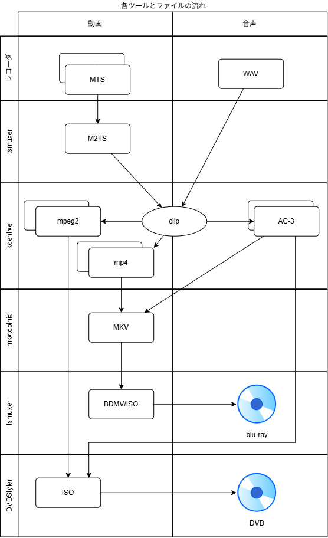

# DVD Blu-ray 作成手順

この手順書は、オープンソースソフトウェアだけでビデオ編集、および、DVD、blu-rayディスクを作成する手順書です。Windowsで使用可能なお手軽な編集ソフト、オーサリングソフト、そしてラベル作成ソフトなど、フリーソフトウェアであればすぐに陳腐化してしまい、供給が滞ったり、有償ソフトであれば極めて高額な費用が必要になります。

永続的に編集、オーサリング、ラベル作成一連の作業のコンピュータ環境の維持にはオープンソースソフトウェアを活用することが一番適していると言えます。この手順書では、このようなオープンソースソフトウェアのみを用いて動画編集を行う手順について説明します。

作業環境のOSについてもWindowsに限らず、Linuxでも対応可能となるソフトウェアを選んでいますので、プラットフォームを選ばず、普遍的な手順となることが期待できるでしょう。

この手順で必要とされるアプリケーションソフトウェアは次のとおりです。
```{list-table}
:header-rows: 1

* - ソフトウェア名
  - 説明
  - ライセンス
  - Windowsのインストール方法
  - Debian系Linuxインストール方法
* - [kdenlive]((https://kdenlive.org/))
  - マルチトラック動画編集ソフト
  - GPL v3
  - `winget install KDE.Kdenlive`
  - `apt install kdenlive` 
* - [mkvtoolnix](https://mkvtoolnix.download/)
  - 動画（h.264）、音声コーデック（AC-3）を指定して複数の動画を一本に結合するソフトウェア
  - GPL v2 またはそれ以降
  - `winget install MoritzBunkus.MKVToolNix`
  - `apt install mkvtoolnix`
* - [tsmuxer](https://github.com/justdan96/tsMuxer)
  - ブルーレイのオーサリングソフトウェア
  - Apache License 2.0
  - [githubサイトからダウンロード](https://github.com/justdan96/tsMuxer/releases)
  - [githubサイトからダウンロード](https://github.com/justdan96/tsMuxer/releases)
* - [DVDStyler](https://dvdstyler.com/)
  - DVDオーサリングソフトウェア
  - GPL (GNU General Public License)
  - `winget install AlexThuering.DVDStyler`
  - `apt install dvdstyler`
* - [scribus](https://www.scribus.net/)
  - DVD, Blu-ray のラベル製作に用いるDTPソフトウェア
  - GPL (GNU General Public License)
  - `winget install Scribus.Scribus`
  - `apt install scribus`
```

また、これらのソフトウェアを使ったファイルの流れは次のとおりです。

{align=center}

```{toctree}
:maxdepth: 2
:numbered: 2
:caption: 目次

video_edit/index
pre-process/index
youtube/index
blu-ray/index
dvd/index
packking/index
```
