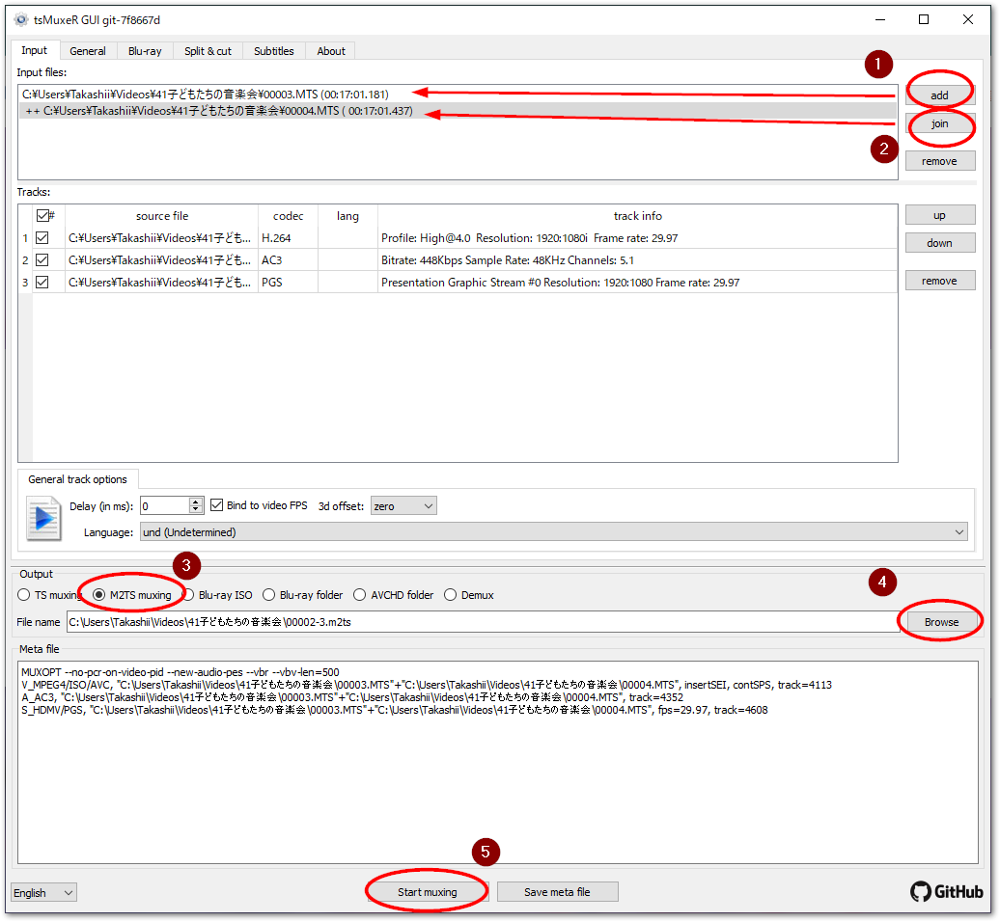
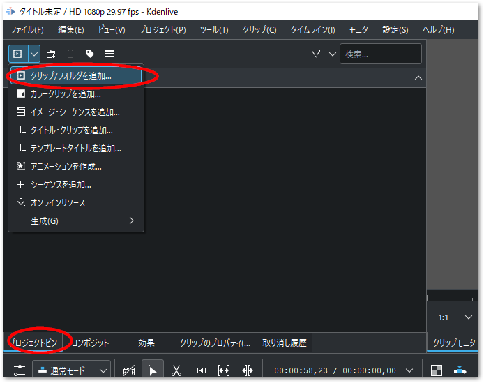
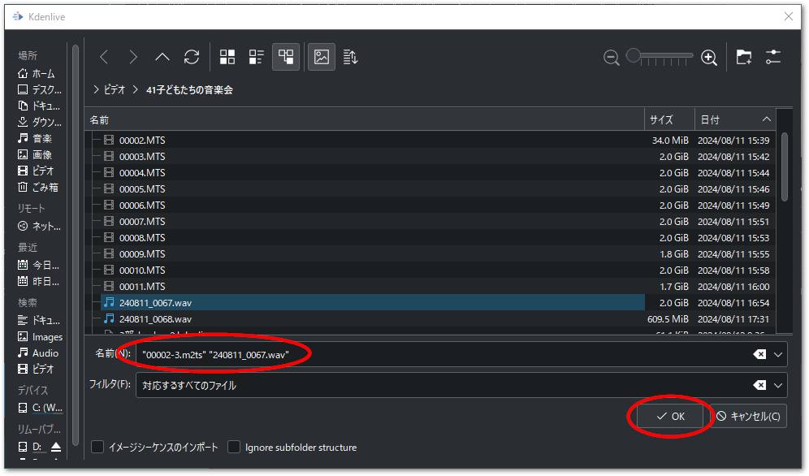
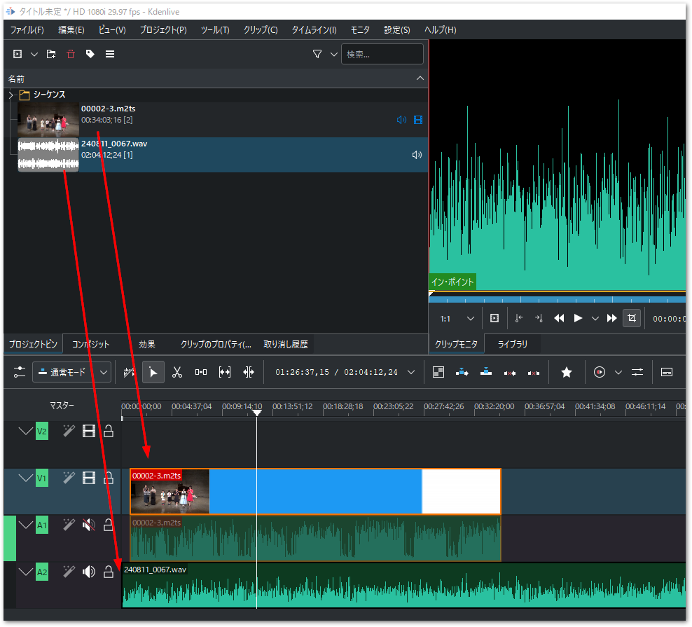
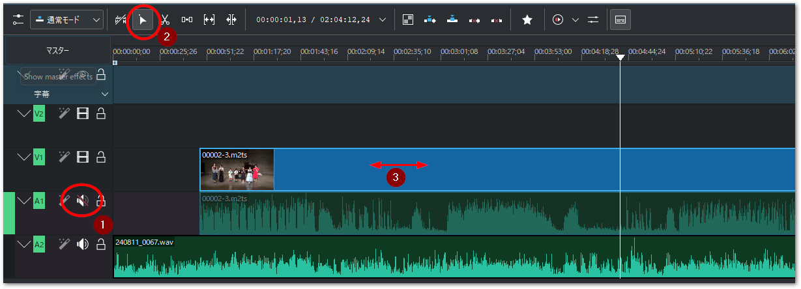
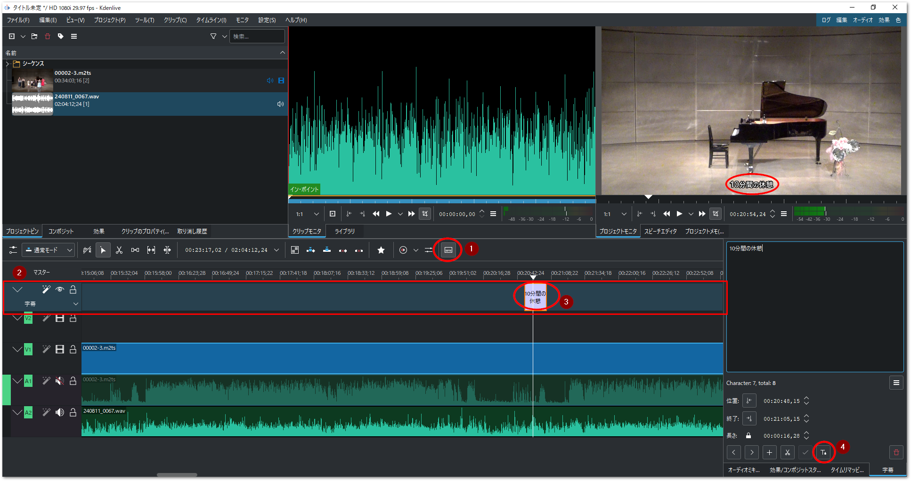

# 動画編集

複数の動画、および音声ファイルを同期し、あるいは長時間記録の場合複数に分離したファイルを結合するのに動画編集ソフトが必要です。

```{admonition} 必要なソフトウェアと入手先

kdenlive
    : 動画編集ソフトです。
    : [https://kdenlive.org/en/download/](https://kdenlive.org/en/download/)

tsMuxeR
    : ビデオファイルの結合に使用します。以下から最新のNightly Buildをダウンロードしてください。

    : [https://github.com/justdan96/tsMuxer/releases](https://github.com/justdan96/tsMuxer/releases)
```


## 動画・音声の結合

通常、連続して撮影した家庭用ビデオでは、動画ファイルが大きなファイルになりすぎないように、2Gbyteの大きさで分割されます。これらのファイルは単純に動画ファイルで結合しただけではどうしても隙間が生じてしまいます。

よって、編集ソフトウェアに読み込む前には連続した動画データとなるように専用のソフトウェアで結合を行う必要があります。tsMuxeRというソフトがこの結合を担います。次の手順に従ってください。

1. tsMuxeRを起動すると`Input` タブが開いた状態でウインドウが現れます。右端の`add`ボタンで、最初のMTSファイルを選びます。
2. 次に続く結合ファイルを、`join`ボタンを押して選択します。Input filesには、先頭のファイルが最上位に一覧され、`++`が頭に表示された結合ファイルが続きます。他にも結合する動画ファイルが複数ある場合は引き続き`join`でファイルを一覧します。
3. Outputに`M2TS muxing`を選択します。
4. Browseで保存先のファイルを指定します。
5. `Start muxing` ボタンを押すと、結合処理が開始します。
6. 終了すると、シャラララランという音で知らせます。

{align=center}

### 撮影した動画や音声ファイルの読み込み

プロジェクトピンタブから `クリップ / フォルダを追加...` メニューを選び、現れたエクスプローラからさきほど結合した動画ファイルや音声ファイルを選択します。CTLRやShiftを押しながらまとめて選択できます。

{align=center}

{align=center width=650px}

結合したm2tsファイルをV1、A1トラックに、音声ファイル wavを A2トラックへドラッグアンドドロップします。

{align=center}

### 動画と音声の同期

読み込んだデータは、動画＋音声の付いたビデオカメラデータ、そして、レコーダによる音声のみのデータです。専用レコーダの音声データは高音質ですのでこちらを優先させ、ビデオカメラは動画のみトラック上で有効にし、音声と動画の同期を取ります。

1. まず、ビデオカメラのAVトラックのうち、音声トラック（A1）のみミュート（消音）します。スピーカアイコンをクリックして斜線が入った状態にしてください。
2. トラックの選択ツールをクリックします。
3. 時間が短い方のパーツ（次図の例ではビデオカメラのAVトラック）を選択して左右にずらしながら、音声と合う場所を探します。

{align=center}

### 不要な部分のカットとフェードイン、アウト


### 字幕

字幕を付けるには、字幕機能と（テンプレート）タイトルクリップ機能の二つの方法があります。字幕機能は改行や自由なレイアウトは難しく、単に文字列をオーバラップ出力するだけの機能となります。タイトルクリップは、ワイプやフェードイン/アウトなど多彩な効果が可能です。

ここでは以下の手順で字幕機能を使って字幕を挿入する手順を説明します。

1. タイムラインメニューバーの右端にある「字幕ツール」アイコンをクリックします。
2. 赤枠のとおり字幕ツールが現れます。
3. 字幕ツール上の任意のタイムの場所でダブルクリックすると、字幕が挿入できます。字幕文字列を入力したあと、帯の左右の端をマウスでドラッグし、必要な長さに調整してください。
4. 必要に応じて字幕のフォント、背景、出現個所をカスタマイズできます。

{align=center}

## 変換

各用途向けのデータを出力します。

Youtube向け

    : AAC/H.264コーデックを選択します。mp4の拡張子で出力します。

DVD向け

    : MPEG2形式で出力します。

Blu ray向け

    : 動画データはH.264で良いのですが、音声はAC3が必要です。別途AC3音声のみのデータを出力します。