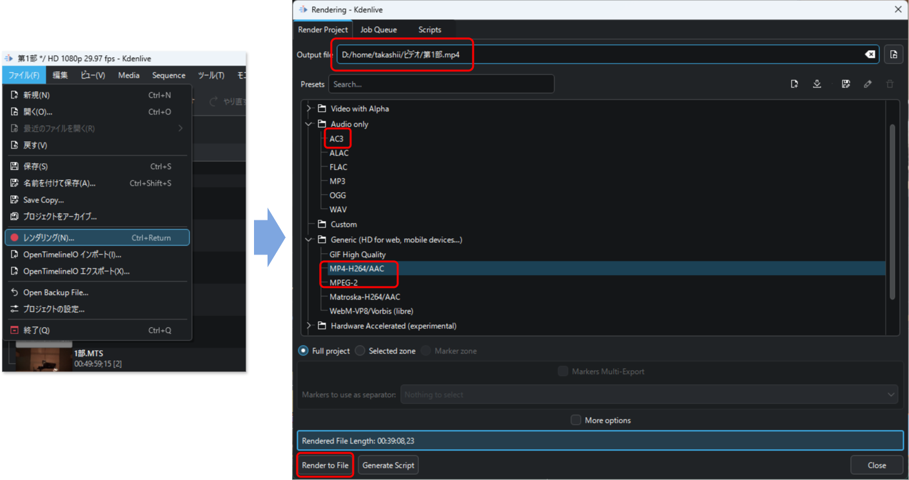
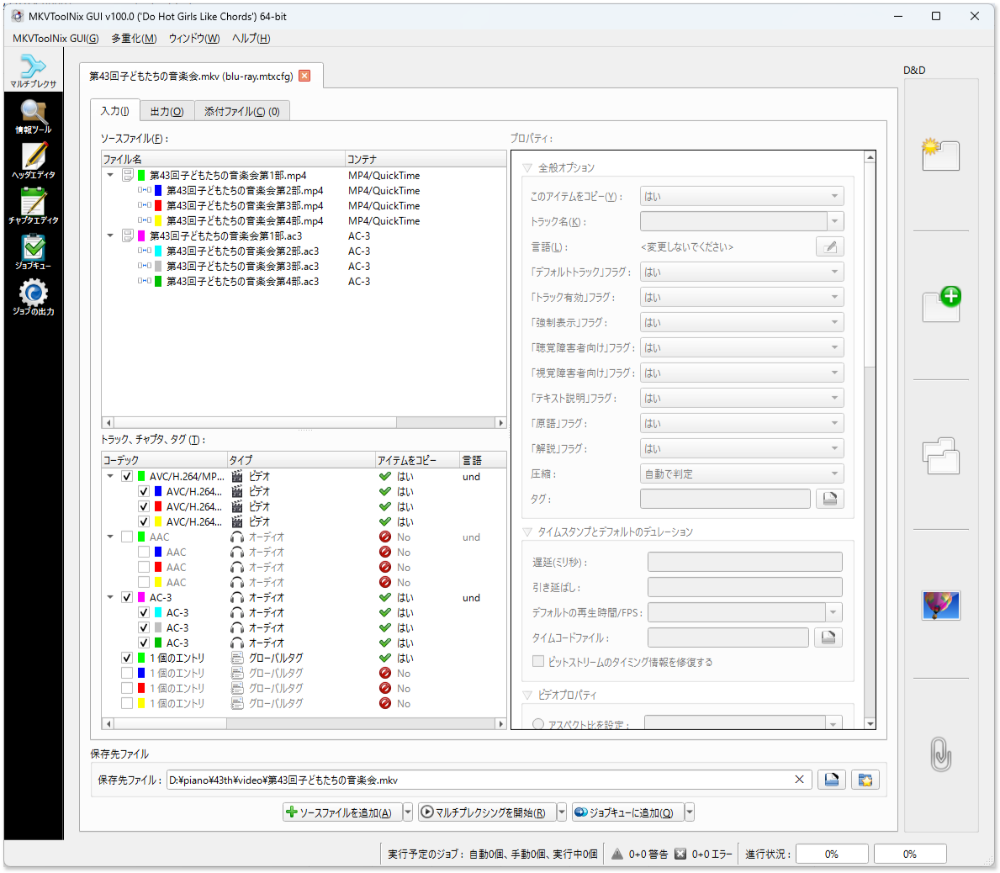

# 各種データの前処理

tsdemuxerを用いてオーサリングを行います。次からダウンロードしてください。

```{admonition} ダウンロード
mkvtoolnix
    : OSごとに次のコマンドでパッケージインストールが可能です。
    : Windows
        : ` winget install MoritzBunkus.MKVToolNix `
    : Linux
        : ` apt install mkvtoolnix `

tsmuxer
    : 以下から最新のリリース版の2つのファイルをダウンロードして解答します。
        * tsMuxer-*.*.*-(linux|mac|win32|win64).zip
        * tsMuxerGUI-*.*.*-(linux|mac|win32|win64).zip
    : [https://github.com/justdan96/tsMuxer/releases](https://github.com/justdan96/tsMuxer/releases)
```

次の手順でblu-rayをオーサリングします。

1. mp4ファイル、および、AC3ファイルをトラックに設定し、個々にm2tsファイルへ変換する。
2. m2tsファイルを結合した上で、blu-rayのISOファイルに変換する。


## kdenliveからのエクスポート

kdenliveでのビデオ編集は、コンサートのプログラムメニューの部毎に分けて行われます。この単位で各種形式の動画データを出力します。kdenliveのプロジェクトのファイルメニューから `レンダリング` を選び、用途に合わせた各種ファイルを出力します。

MP4-H264/AAC
    : Youtubeへの公開用ファイル。また、blu-rayの動画データ（音声除く）として使用します。mp4の拡張子で出力します。

MPEG 2
    : DVD向け

AC3
    : Blu-rayプロジェクトには h.264 形式の動画と、AC-3形式の音声が必要です。動画データはMP4エクスポート時に出力されましたが、音声はAAC形式となっていますので、音声だけAC-3データを出力します。


{align=center}

## MKV形式への統合化

kdenliveで出力する単位は、部毎に分けられてますので、次の目的によりこれを連続した一つの動画へ変換を行います。

* Blu-rayにはDVDのようなタイトルを持たないため、連続した動画として構成します。このため、MKVという形式で部毎に分かれた動画を一本の動画に結合します。

* 後ほどBlu-rayオーサリングする際には、一本の動画にチャプターを設定し、各プログラムの頭出しを可能にします。また、演目が始まると、個々に字幕によるタイトル表示が必要です。このため、頭出し時刻、字幕データをExcelなどの表計算ソフトでまとめるため、参照用の動画としてMKV動画を使用します。

最初に、設定イメージを見ていただく方が理解が早いと思います。次図のとおり、ソースファイルに示されているのはkdnliveによりレンダリングしたmp4ファイルとac3ファイルです。このコンサートのプログラムは1部～4部まで構成されていて、事前に各部毎に個別のmp4, ac3ファイルをエクスポートしています。

{align=center}

これを読み込み、bul-rayに必要な、H.264形式の動画と、AC-3形式の音声のみにチェックを入れて、下部にある「マルチプレクシングを開始」ボタンを押すことで、その上の保存先ファイル名に記載しているMKVファイルを保存します。

(section_chapter_cue)=
## チャプタ割の調査シート作成

出力したmkvファイルは、VLCプレイや等で再生することができます。この動画を見ながら出演者のステージの開始時間を記録して頭出し時間のリストをExcelで作成します。blu-rayディスク再生時の頭出しとして最適な時刻を特定し、{ref}`table_subtitle_def` の表にE列 「チャプター区切り時刻」列を追加し（{numref}`table_chapter_def`）、そこへ特定した時刻を追記します。

```{list-table} 字幕+チャプター定義 "titles.csv" ファイル
:header-rows: 2
:stub-columns: 1
:name: table_chapter_def

* - 
  - A
  - B
  - C
  - D
  - E
  - F
  - G
* - 1
  - 字幕開始
  - 字幕終了
  - 字幕
  - チャプター区切り時刻
  - 作曲者
  - タイトル
  - 演奏者
* - 2
  - 00:00:08.000
  - 00:00:08.000
  - ベートーベン作曲 ピアノソナタ第8番悲愴第一楽章 \
    演奏: Aさん
  - 00:00:00.000
  - ベートーベン
  - ピアノソナタ第8番悲愴第一楽章
  - Aさん
* - 3
  - 00:12:18.000
  - 00:12:28.000
  - ショパン作曲 即興曲第2番 \
    演奏:Bさん
  - 00:12:12.000
  - ショパン
  - 即興曲第2番
  - Bさん
* - 
  - <div style="text-align: center;">:</div>
  - <div style="text-align: center;">:</div>
  - <div style="text-align: center;">:</div>
  - <div style="text-align: center;">:</div>
  - <div style="text-align: center;">:</div>
  - <div style="text-align: center;">:</div>
  - <div style="text-align: center;">:</div>
```