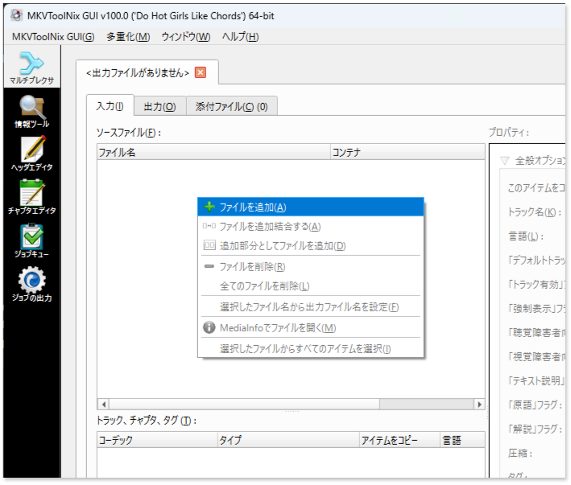
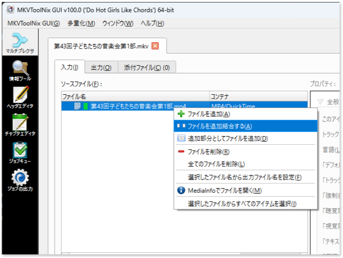
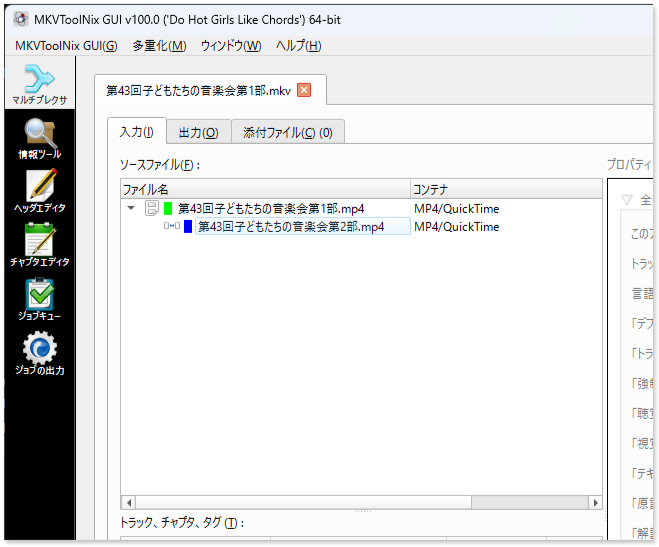
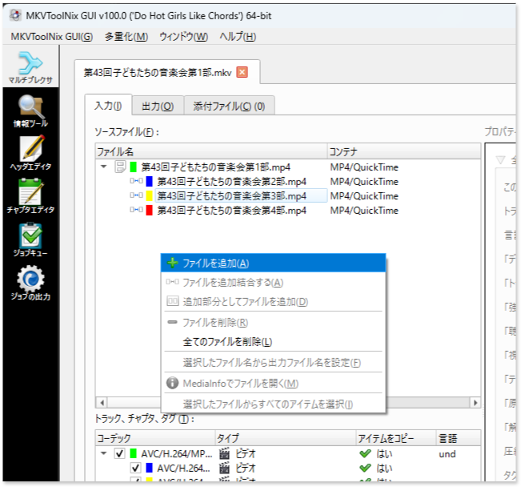
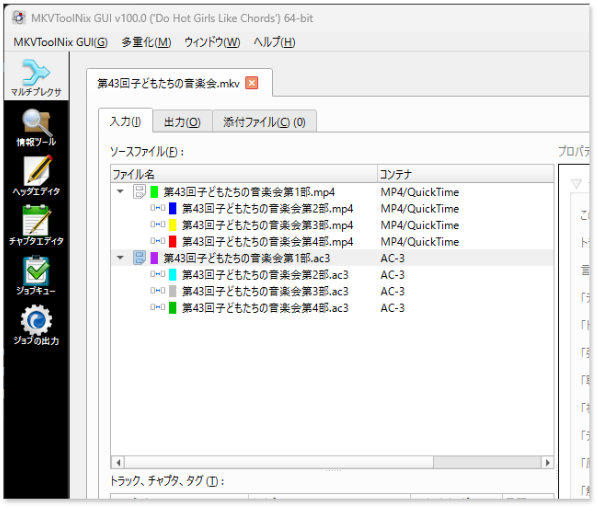
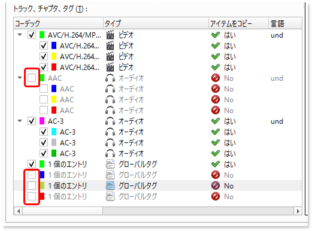

# 各種データの前処理

tsdemuxerを用いてオーサリングを行います。次からダウンロードしてください。

```{admonition} ダウンロード
mkvtoolnix
    : OSごとに次のコマンドでパッケージインストールが可能です。
    : Windows
        : ` winget install MoritzBunkus.MKVToolNix `
    : Linux
        : ` apt install mkvtoolnix `

tsmuxer
    : 以下から最新のリリース版の2つのファイルをダウンロードして解答します。
        * tsMuxer-*.*.*-(linux|mac|win32|win64).zip
        * tsMuxerGUI-*.*.*-(linux|mac|win32|win64).zip
    : [https://github.com/justdan96/tsMuxer/releases](https://github.com/justdan96/tsMuxer/releases)
```

編集済みのkdenliveのプロジェクトから、次のデータを出力します。

各種形式の動画・音声データエクスポート
  : 家庭用ビデオで録られたフォーマットは、基本Timecodeが無く、Recrunの時間単位での動画データとなります。つまりプログラムの第一部、第二部ごとにカメラの録画を停止しますので、この単位で個別の編集プロジェクトができます。プロジェクト毎、Youtube向けにMP4, DVD向けにMPEG2, Blu-ray向けにAC-3形式の音声を個々にエクスポートします。

blu-rayディスク用MKVファイル
  : Blu-rayに対しては、第一部、第二部・・・ごとに分かれた動画ファイルを再結合し、一枚のディスクイメージの基を作成します。このデータをMKVフォーマットで生成します。

チャプター割り設定一覧
  : Blu-ray, DVDをオーサリングする際には、各プログラム演目毎に頭出しできるチャプターを設定します。MKVに連続化した時刻で、各演目毎の頭出し時刻を確定します。

## 各種形式の動画・音声データエクスポート

kdenliveでのビデオ編集は、コンサートのプログラムメニューの部毎に分けて行われます。この単位で各種形式の動画データを出力します。kdenliveのプロジェクトのファイルメニューから `レンダリング` を選び、用途に合わせた各種ファイルを出力します。

MP4-H264/AAC
    : Youtubeへの公開用ファイル。また、blu-rayの動画データ（音声除く）として使用します。mp4の拡張子で出力します。

MPEG 2
    : DVD向け動画データに使用します。

AC3
    : Blu-rayプロジェクトには h.264 形式の動画と、AC-3形式の音声が必要です。動画データはMP4エクスポート時に出力されましたが、音声はAAC形式となっていますので、音声だけAC-3データを出力します。


{align=center}

## blu-rayディスク用MKVファイル作成

Blu-rayにはDVDのようなタイトルを持たないため、連続した動画として構成します。このため、MKVという形式で部毎に分かれた動画を一本の動画に結合します。

### 手順

::::{grid} 2
:gutter: 1 1 2 3
:::{grid-item} 
{align=center}
:::
:::{grid-item}  1つ目のMP4ファイルの追加
:columns: 12 12 6 6

1. ソースファイルウィンドウ上で右クリックし、 **ファイルを追加( <u>A</u>)** を選びます。
2. ファイル選択からmp4ファイルを選択します。
:::
:::{grid-item}
:columns: 12 12 6 6

{align=center}
:::
:::{grid-item}  2つ目のMP4ファイルの結合
:columns: 12 12 6 6

選択されたmp4ファイルが一覧されますので、ここに別のmp4ファイルを結合します。結合したいmp4を選んで右クリックし、**ファイルを追加結合する(<u>A</u>)** を選択します。
:::
:::{grid-item}
:columns: 12 12 6 6

{align=center}
:::
:::{grid-item} 2つ目のMP4ファイルを追加した状態
:columns: 12 12 6 6

追加結合されたファイルは、結合元ファイルのツリーの子として一覧されます。同様の方法で第1部～第4部のようにプログラム部構成毎に個別に出力したmp4ファイルをすべて結合してください。
:::
:::{grid-item}
:columns: 12 12 6 6

{align=center}
:::
:::{grid-item} AC-3ファイルの追加
:columns: 12 12 6 6

mp4ファイルに含まれる音声コーデックはAACですが、blu-rayには最大5.1チャンネルのサラウンド音声に対応したドルビー LABORATORIES（Dolby）の音声圧縮技術であるAC-3が使われています。kdenliveでレンダリングしたAC-3を同様に読み込みます。
:::
:::{grid-item}
:columns: 12 12 6 6

{align=center}
:::
:::{grid-item} AC-3についても同様にツリー状に結合します。
:columns: 12 12 6 6

:::
:::{grid-item}
:columns: 12 12 6 6

{align=center}
:::
:::{grid-item} 下部の **トラック、チャプタ、タグ（<u>T</u>）** 不要なデータを削除します。
:columns: 12 12 6 6

* AAC音声コーデックはすべてチェックを外します。
* グローバルタグは先頭の1つだけにします。
:::
::::

以上の設定を行ったら、保存先ファイルに保存先のMKVファイル名を指定し、その下の **マルチプレクシングを開始(<u>R</u>)** ボタンを押すと変換が開始されます。右下の **進行状況：** に変換の進捗が確認できます。左側のメータは0%, 右側のメータが100%となると変換の完了です。

{align=center}


処理が完了したら保存先に指定したMKVファイルを取り出してください。

(section_chapter_cue)=
## チャプター割り設定一覧作成

出力したmkvファイルは、VLCプレイや等で再生することができます。この動画を見ながら出演者のステージの開始時間を記録して頭出し時間のリストを、字幕作成時に作成した（{numref}`table_chapter_def`）Excelに追記します。blu-rayディスク再生時の頭出しとして最適な時刻を特定し、{ref}`table_subtitle_def` の表にD列 「チャプター（全体）」列を追加して特定した時刻を追記します。

また、DVD向けには、第一部、第二部・・・ごとのkdenliveのプロジェクト毎にタイトルチャプターを設定します。その中の頭出し用のチャプターは、基本、第N部毎に00:00:00.000にリセットした時刻からの経過時間での頭出し時刻を指定する必要があります。これをE列「チャプター（個別）」列を追加して特定した時刻を追記します。

```{list-table} 字幕+チャプター定義 "titles.csv" ファイル
:header-rows: 2
:stub-columns: 1
:name: table_chapter_def

* - 
  - A
  - B
  - C
  - D
  - E
  - F
  - G
  - H
* - 1
  - 字幕開始
  - 字幕終了
  - 字幕
  - チャプター(全体)
  - チャプター(個別)
  - 作曲者
  - タイトル
  - 演奏者
* - 2
  - 00:00:08.000
  - 00:00:08.000
  - ベートーベン作曲 ピアノソナタ第8番悲愴第一楽章 \
    演奏: Aさん
  - 00:00:00.000
  - 00:00:00.000
  - ベートーベン
  - ピアノソナタ第8番悲愴第一楽章
  - Aさん
* - 3
  - 00:12:18.000
  - 00:12:28.000
  - ショパン作曲 即興曲第2番 \
    演奏:Bさん
  - 00:12:12.000
  - 00:12:12.000
  - ショパン
  - 即興曲第2番
  - Bさん
* - 
  - <div style="text-align: center;">:</div>
  - <div style="text-align: center;">:</div>
  - <div style="text-align: center;">:</div>
  - <div style="text-align: center;">:</div>
  - <div style="text-align: center;">:</div>
  - <div style="text-align: center;">:</div>
  - <div style="text-align: center;">:</div>
  - <div style="text-align: center;">:</div>
```