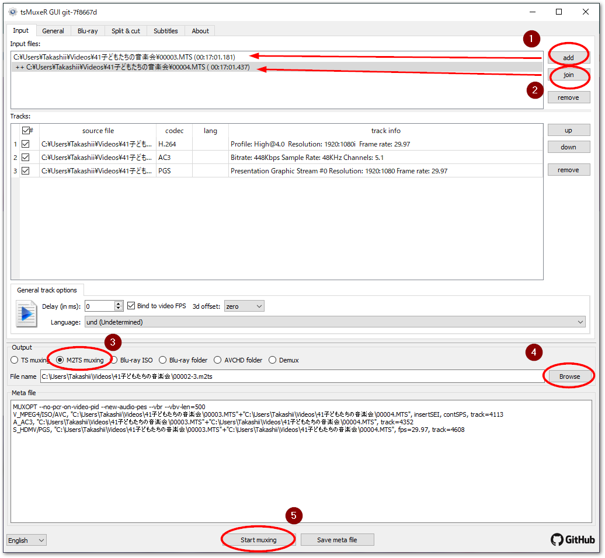
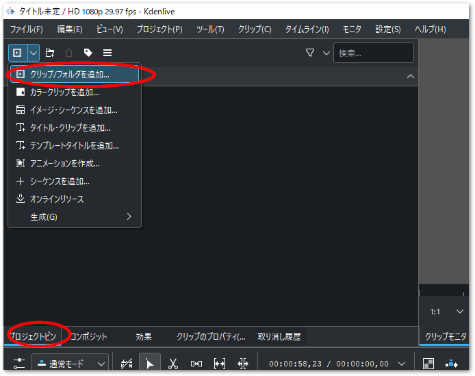
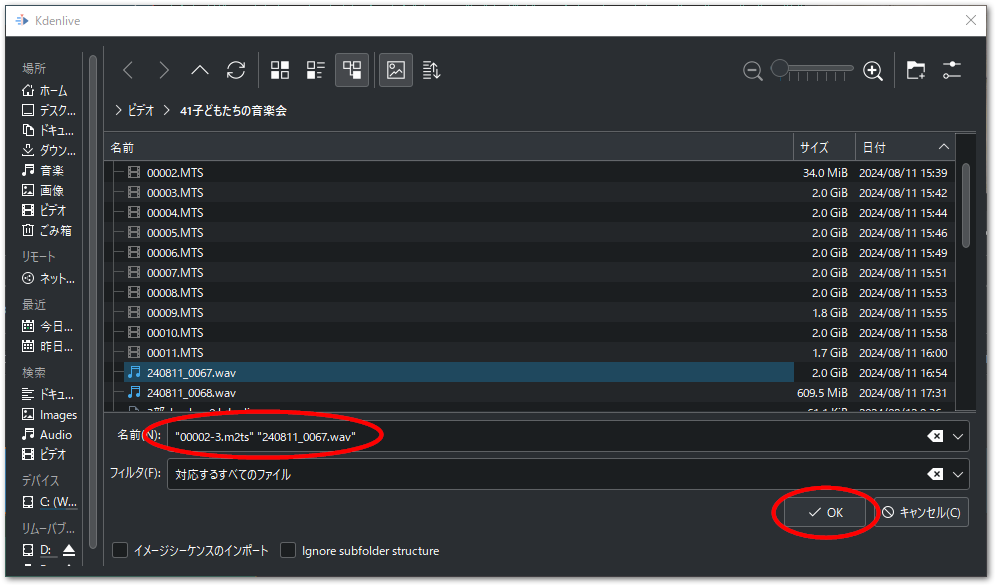
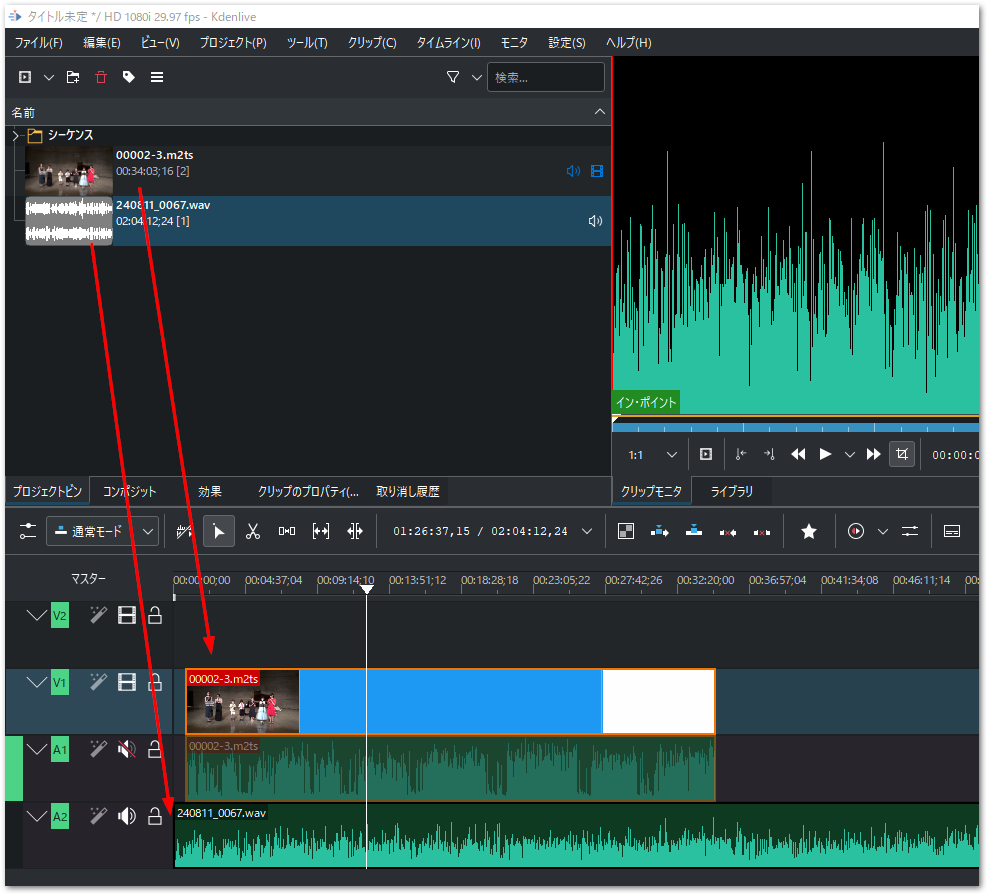
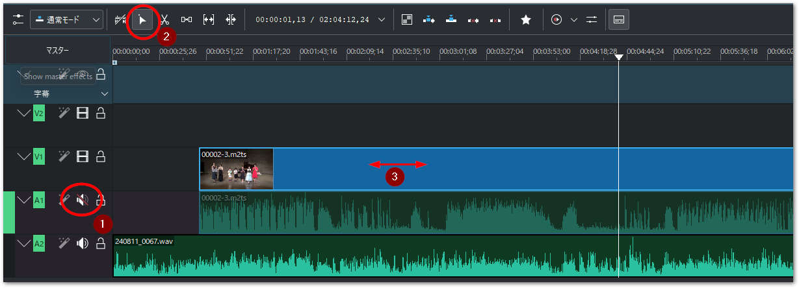
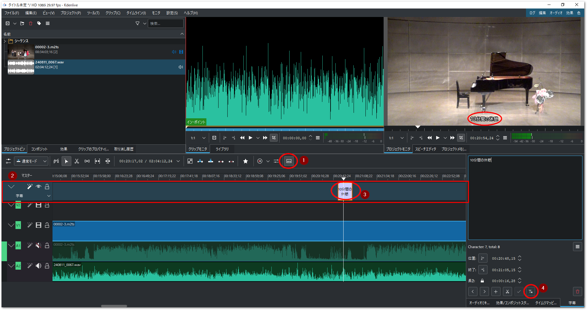
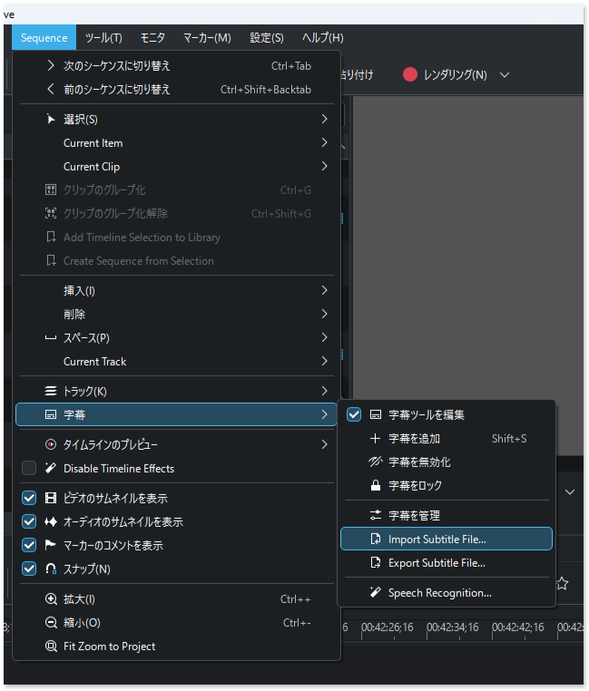
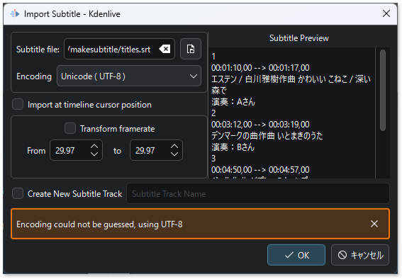

# 動画編集

複数の動画、および音声ファイルを同期し、あるいは長時間記録の場合複数に分離したファイルを結合するのに動画編集ソフトが必要です。

```{admonition} 必要なソフトウェアと入手先

kdenlive
    : 動画編集ソフトです。
    : [https://kdenlive.org/en/download/](https://kdenlive.org/en/download/)

tsmuxer
    : 以下から最新のリリース版の2つのファイルをダウンロードして解答します。
        * tsMuxer-*.*.*-(linux|mac|win32|win64).zip
        * tsMuxerGUI-*.*.*-(linux|mac|win32|win64).zip
    : [https://github.com/justdan96/tsMuxer/releases](https://github.com/justdan96/tsMuxer/releases)
```


## 動画・音声の結合

通常、連続して撮影した家庭用ビデオでは、動画ファイルが大きなファイルになりすぎないように、2～4Gbyteの大きさで分割されます。これらのファイルを一つのファイルに結合するためtsMuxeRというソフトを用います。

次の手順に従ってください。

1. tsMuxeRを起動すると`Input` タブが開いた状態でウインドウが現れます。右端の`add`ボタンで、最初のMTSファイルを選びます。
2. 次に続く結合ファイルを、`join`ボタンを押して選択します。Input filesには、先頭のファイルが最上位に一覧され、`++`が頭に表示された結合ファイルが続きます。他にも結合する動画ファイルが複数ある場合は引き続き`join`でファイルを一覧します。
3. Outputに`M2TS muxing`を選択します。
4. Browseで保存先のファイルを指定します。
5. `Start muxing` ボタンを押すと、結合処理が開始します。
6. 終了すると、シャラララランという音で知らせます。

{align=center}


```{tip}
家庭用ビデオカメラの保存形式であるMTS形式のファイルは、MPEG-2 TS と呼ばれるテレビストリーミング動画向けに開発されたコンテナフォーマットです。このフォーマットの特徴は、映像と音声のデータとは別に同期用タイムスタンプが記録される点にあります。長時間録画の際に吐きだされるMTSファイルは、ファイルシステムの最大保存可能サイズの上限に達しないよう、一定のサイズに小分けにして保存されます。このファイル間でのつなぎ目では、音声や動画が欠落する期間が生じないよう、一定の時間オーバラップさせます。そしてTS形式に記録された同期用タイムスタンプを参照することで、余分なオーバラップなく連続した再生が可能となります。

問題は、MTSファイルを単純にkdenliveなどの動画編集ソフトのクリップとして読み込んで結合しただけではこのオーバラップ時間が余分に割り込んでしまう点にあります。音声ファイルを別録りし、kdenliveの別トラックで音声とMTS形式の動画データを合わせると、ファイルの数だけオーバラップ時間が蓄積してしまい、後半になるに従い音声と動画にズレが拡大します。

対策方法としては、このMTSファイルの同期用タイムスタンプを参照して動画ファイルを結合することができるツールを使って連続化することです。これらの機能を備えたツールの代表としてffmpegや、tsMuxeRといったツールがTSフォーマットを加味した結合を実現してくれます。ffmpegはコマンドラインインターフェースですので、少々取り扱いが難しいので、ここではtsMuxeRというツールで結合する手順をご紹介します。

ちなみに、次の節でご紹介するmkvtoolnixはM2TSファイルの同期タイムスタンプは加味せず、単純にファイル同士を結合するだけの機能しか提供しませんのでここでは使用しません。
```

### 撮影した動画や音声ファイルの読み込み

プロジェクトピンタブから `クリップ / フォルダを追加...` メニューを選び、現れたエクスプローラからさきほど結合した動画ファイルや音声ファイルを選択します。CTLRやShiftを押しながらまとめて選択できます。

{align=center}

{align=center width=650px}

結合したm2tsファイルをV1、A1トラックに、音声ファイル wavを A2トラックへドラッグアンドドロップします。

{align=center}

### 動画と音声の同期

読み込んだデータは、動画＋音声の付いたビデオカメラデータ、そして、レコーダによる音声のみのデータです。専用レコーダの音声データは高音質ですのでこちらを優先させ、ビデオカメラは動画のみトラック上で有効にし、音声と動画の同期を取ります。

1. まず、ビデオカメラのAVトラックのうち、音声トラック（A1）のみミュート（消音）します。スピーカアイコンをクリックして斜線が入った状態にしてください。
2. トラックの選択ツールをクリックします。
3. 時間が短い方のパーツ（次図の例ではビデオカメラのAVトラック）を選択して左右にずらしながら、音声と合う場所を探します。

{align=center}

```{warning}
kdenlive には audio による align to reference で音声波形に基づいて動画と音声を自動的に同期する機能がありますが、長時間且つ48khzの非常に大きなサンプリングレートの音声データでこの機能を使用するとコンピュータに大きな負荷となりフリーズする原因となりますので、使用しないでください。
```

### 不要な部分のカットとフェードイン、アウト


### 字幕

字幕を付けるには、字幕機能と（テンプレート）タイトルクリップ機能の二つの方法があります。字幕機能は改行や自由なレイアウトは難しく、単に文字列をオーバラップ出力するだけの機能となります。タイトルクリップは、ワイプやフェードイン/アウトなど多彩な効果が可能です。

ここでは以下の手順で字幕機能を使って字幕を挿入する手順を説明します。

1. タイムラインメニューバーの右端にある「字幕ツール」アイコンをクリックします。
2. 赤枠のとおり字幕ツールが現れます。
3. 字幕ツール上の任意のタイムの場所でダブルクリックすると、字幕が挿入できます。字幕文字列を入力したあと、帯の左右の端をマウスでドラッグし、必要な長さに調整してください。
4. 必要に応じて字幕のフォント、背景、出現個所をカスタマイズできます。

{align=center}

### 字幕を効率的に作成するには

効率的に字幕を作成するには、字幕を一か所づつ編集するよりも、ExcelやGoogle Spreadsheet等表計算ソフトで字幕開始、終了時刻と、字幕の文字の一覧を先に定義しておいた方がいいでしょう。そのあと、字幕定義ファイルの標準であるsrt形式へ変換します。参考例としてcsvからsrtへ変換するpythonスクリプトもご紹介します。

```{list-table} 字幕定義 "titles.csv" ファイル
:header-rows: 2
:stub-columns: 1
:name: table_subtitle_def

* - 
  - A
  - B
  - C
  - D
  - E
  - F
* - 1
  - 字幕開始
  - 字幕終了
  - 字幕
  - 作曲者
  - タイトル
  - 演奏者
* - 2
  - 00:00:08.000
  - 00:00:08.000
  - ベートーベン作曲 ピアノソナタ第8番悲愴第一楽章 \
    演奏: Aさん
  - ベートーベン
  - ピアノソナタ第8番悲愴第一楽章
  - Aさん
* - 3
  - 00:12:18.000
  - 00:12:28.000
  - ショパン作曲 即興曲第2番 \
    演奏:Bさん
  - ショパン
  - 即興曲第2番
  - Bさん
* - 
  - <div style="text-align: center;">:</div>
  - <div style="text-align: center;">:</div>
  - <div style="text-align: center;">:</div>
  - <div style="text-align: center;">:</div>
  - <div style="text-align: center;">:</div>
  - <div style="text-align: center;">:</div>
```

{numref}`table_subtitle_def` に示す例では、D,E,F列の内容を次のような関数を定義することで、字幕文字列として表記C列に表記されます。2行目のC列のセルの関数例です。セル内で改行するには、改行位置でCTRLキーを押しながらENTERキーを押してください。

```
="""&D2&"作曲 "&E2&" 
"&"演奏:"&F2&"""
```

この表を titles.csv としてUTF-8形式で保存し、次のPythonスクリプトを同じディレクトリで実行すると、titles.srtファイルが出力されます。

```{code-block} python
import csv

def csv_to_srt(csv_file_path, srt_file_path):
    with open(csv_file_path, 'r', encoding='utf-8') as csv_file:
        reader = csv.reader(csv_file)
        header = next(reader) # ヘッダーをスキップ

        with open(srt_file_path, 'w', encoding='utf-8') as srt_file:
            index = 1
            for row in reader:
                start_time = row[0]
                end_time = row[1]
                text = row[2]

                # タイムスタンプの形式を変換 (例: 00:00:01,000)
                start_time_srt = start_time.replace('.', ',')
                end_time_srt = end_time.replace('.', ',')

                srt_file.write(f"{index}\n")
                srt_file.write(f"{start_time_srt} --> {end_time_srt}\n")
                srt_file.write(f"{text}\n\n")
                index += 1

csv_to_srt('titles.csv', 'titles.srt')
```

このスクリプト実行により、`titles.srt` ファイルが生成されます。kdenliveのメニューバーから `Sequence` > `字幕` > `import Subtitle File...` を選択します。

{align=center}

import Substitule ウィンドウの Subtitle file フィールドの右端のボタンを押すとファイル選択が現れます。出力された `titles.srt` を選択すると、右端にプレビューが現れます。

{align=center}

OKを押すと、読み込まれた字幕定義が、しかるべきタイムラインに表示されます。
