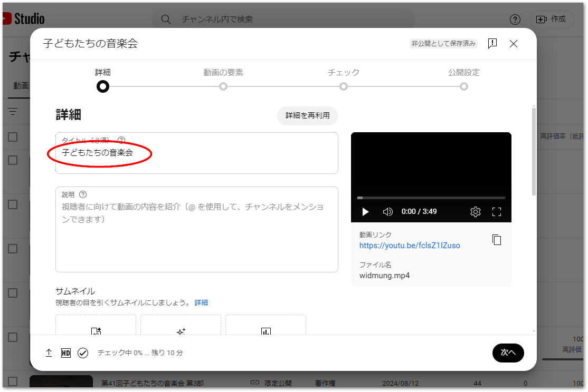
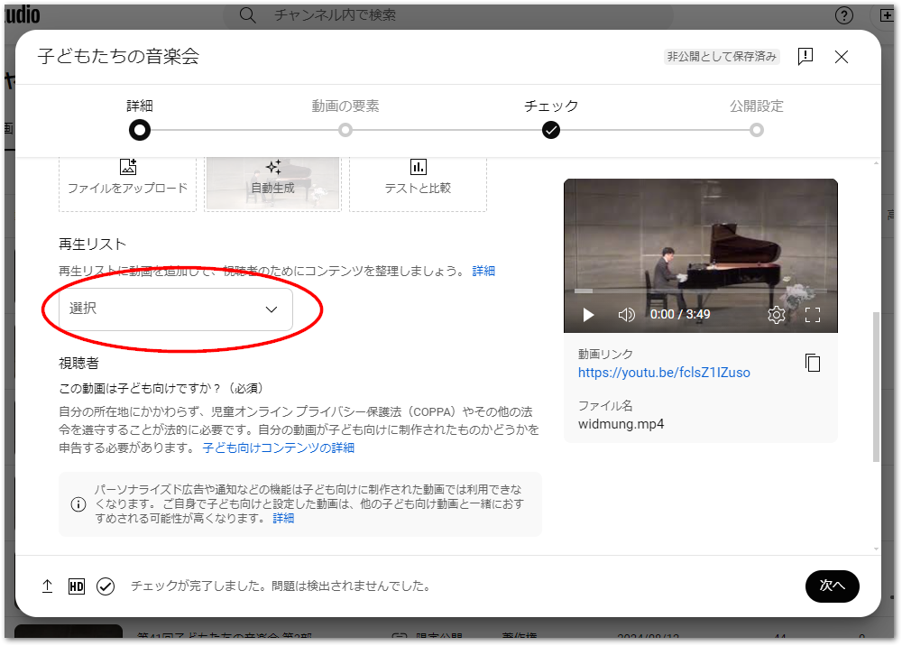
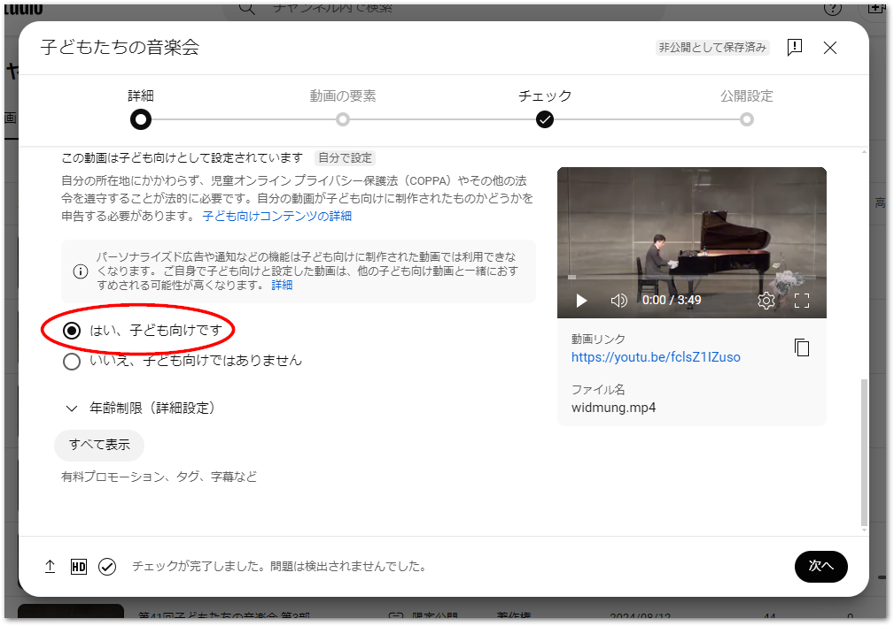
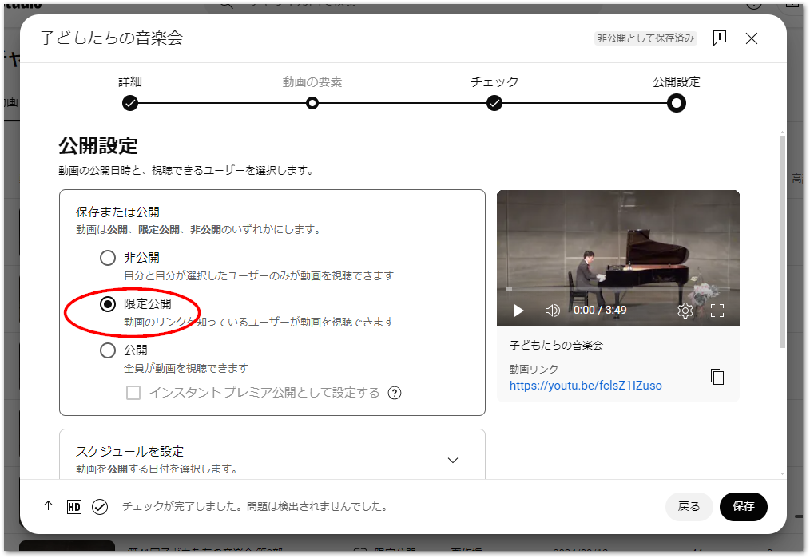

# 動画の公開・チャプタ割の計算

Youtube向けに出力したマスタデータを基に、Youtubeへのアップロードの公開、チャプタ割時間シートを作成します。

## Youtubeへのアップロード

以下の手順でYouTubeにて動画をアップロードし、限定公開します。

1. まずはタイトルを入力します。必要に応じて説明を記入してください。

    {align=center}

2. 複数の部の、複数のファイルに分けた場合、再生リストにまとめると便利です。ここから新しい再生リストを作成することができます。

    {align=center}

3. パーソナライズド広告を無効化するため、子供向けコンテンツに設定します。動画へのコメント投稿などの機能も無効となります。

    {align=center}

4. 動画の要素、チェックのページで「次へ」ボタンを押してページを送ります。
5. 公開設定のページでは、「限定公開」に設定します。URLをお知らせした対象の方だけに動画を公開することができます。

    {align=center}

(section_chapter_cue)=
## チャプタ割の調査シート作成

出演者のステージの開始時間を記録して頭出し時間のリストをExcelで作成します。テンプレートは以下からダウンロードしてください。

{download}`chapter.xlsx<./assets/chapter.xlsx>`

### 「部ごとの時間」シート

部（動画ファイル）毎のトータル時間を記録します。部毎の総時間をH, M, S, MS列にそれぞれ分けて入れてください。

```{csv-table}
:header: 部,H,M,S,MS,VALUE,SUM

1,0,35,42,552,00:35:42.552,00:35:42.552
2,0,23,57,185,00:23:57.185,00:59:39.737
3,0,53,5,431,00:53:05.431,01:52:45.168
4,0,30,1,816,00:30:01.816,02:22:46.984
```

### 「time_table」シート

出演ステージの頭出し時間をH, M, S, MS列に設定します。チャプタ毎に個別の動画ファイルになっているため、部毎に0:0:0.000からスタートします。タイトル画面など頭出しが不要な場合は省いても構いません。

```{csv-table}
:header: 部,H,M,S,MS,時刻,通算,内容,出演時間

1,0,0,8,0,00:00:08.000,00:00:08.000,オープニング,00:01:43.000
1,0,1,51,0,00:01:51.000,00:01:51.000,Aさん演奏,00:02:19.000
1,0,4,10,0,00:04:10.000,00:04:10.000,Bさん演奏,00:03:50.000
:
2,0,0,0,0,00:00:00.000,00:35:42.552,Aさん歌唱,00:07:34.000
2,0,7,34,0,00:07:34.000,00:43:16.552,Bさん歌唱,00:07:41.000
:
3,0,0,0,0,00:00:00.000,00:59:39.737,合唱〇〇,00:04:02.000
3,0,4,2,0,00:04:02.000,01:03:41.737,合奏〇〇,00:04:43.000
:
```
