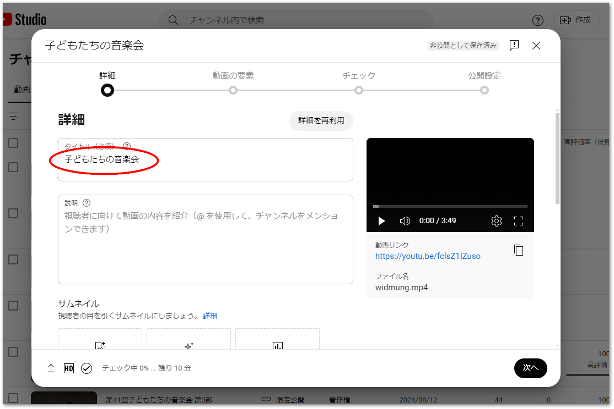
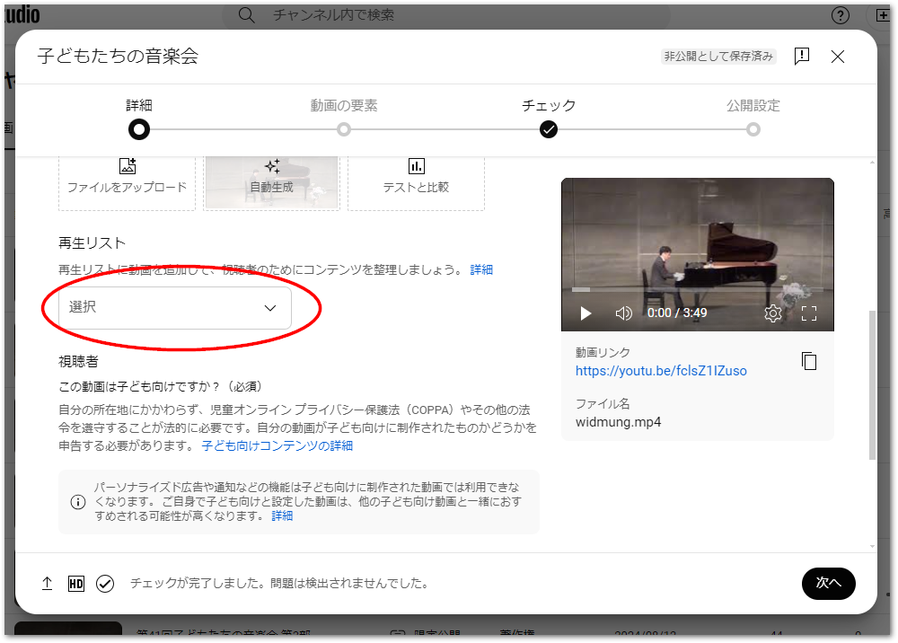
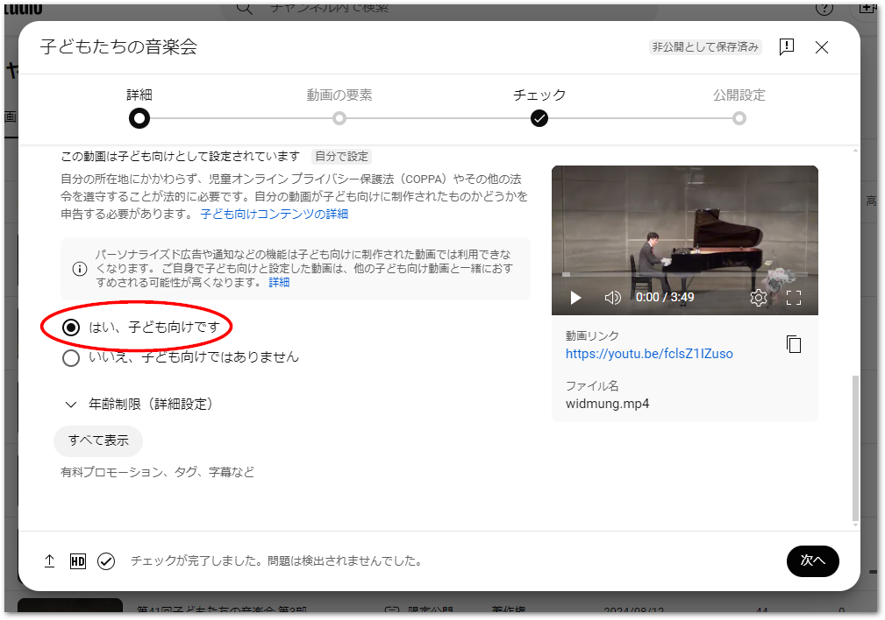
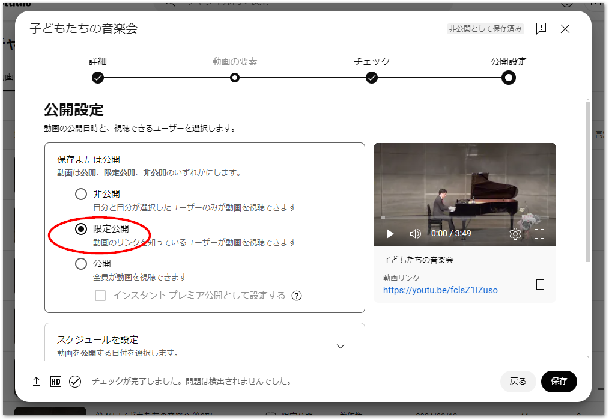

# Youtubeへの動画公開

## Youtubeへのアップロード

kdenliveからレンダリングしたmp4ファイルをyoutubeで限定公開します。以下の手順で行ってください。

1. まずはタイトルを入力します。必要に応じて説明を記入してください。

    {align=center}

2. 複数の部の、複数のファイルに分けた場合、再生リストにまとめると便利です。ここから新しい再生リストを作成することができます。

    {align=center}

3. パーソナライズド広告を無効化するため、子供向けコンテンツに設定します。動画へのコメント投稿などの機能も無効となります。

    {align=center}

4. 動画の要素、チェックのページで「次へ」ボタンを押してページを送ります。
5. 公開設定のページでは、「限定公開」に設定します。URLをお知らせした対象の方だけに動画を公開することができます。

    {align=center}
